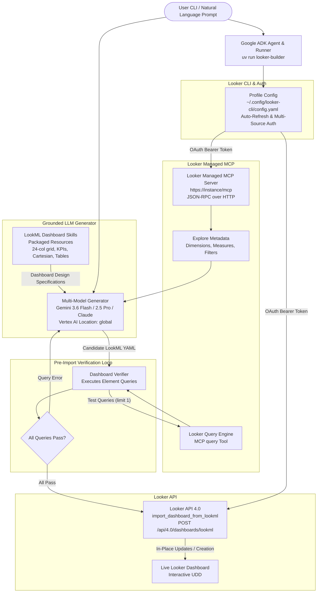

# Looker LookML Dashboard Builder CLI Agent 🚀

A fast, AI-powered CLI agent built with **Google ADK (Agent Development Kit)** that designs, verifies, and iteratively refines Looker dashboards in **LookML**, dynamically inspects semantic schemas from the **Looker Managed Model Context Protocol (MCP)** server, and imports them directly into Looker using the [`import_dashboard_from_lookml`](https://docs.cloud.google.com/looker/docs/reference/looker-api/latest/methods/Dashboard/import_dashboard_from_lookml) Looker API.

> [!NOTE]
> **Dashboard-Focused Workflow**: This CLI is designed specifically for dashboard creation and refinement off your existing Looker semantic models. It does not alter your underlying LookML project files (views, models, PDTs). Instead, it compiles declarative LookML dashboard YAML and deploys it directly as an interactive, live **User-Defined Dashboard (UDD)**.

---

## 🌟 Architecture & Workflow



---

## 📋 Prerequisites

Before running the agent, ensure you have the following prerequisites configured:

1. **Looker CLI (`looker-cli`)**:
   - Installed and authenticated with your Looker instance:
     ```bash
     # Verify installation
     looker-cli --version

     # Authenticate and set active profile
     looker-cli session login
     # Or verify active session
     looker-cli user me
     ```
   - Configuration is automatically read from `~/.config/looker-cli/config.yaml`.

2. **Looker Instance & Managed MCP**:
   - Looker API 4.0 enabled.
   - Looker Managed MCP endpoint enabled at `https://<YOUR_LOOKER_HOST>/mcp`.

3. **Python & Package Manager**:
   - Python 3.11+ installed.
   - [`uv`](https://github.com/astral-sh/uv) (recommended) or `pip`.

4. **Google Cloud / Vertex AI Credentials**:
   - Active Application Default Credentials (ADC) for Gemini / Vertex model access:
     ```bash
     gcloud auth application-default login
     ```
   - Set your GCP project ID and region:
     ```bash
     export GOOGLE_CLOUD_PROJECT="your-gcp-project-id"
     export VERTEXAI_LOCATION="global"
     ```

---

## ⚡ Quick Start with `uv`

### 1. Initialize Virtual Environment & Install Package
```bash
uv venv
uv pip install -e .
```

### 2. Verify Looker Connection & MCP Status
```bash
uv run looker-builder status
```

---

## 💻 CLI Commands & Examples

### 1. Check MCP Status
```bash
uv run looker-builder status
```
Displays active profile, connected host, MCP endpoint, server version, tool count, and available LookML models.

### 2. Discover Semantic Models & Explores
```bash
# List all models
uv run looker-builder models

# List explores within a model
uv run looker-builder explores <MODEL_NAME>

# Inspect dimensions and measures for an explore
uv run looker-builder fields <MODEL_NAME> <EXPLORE_NAME>
```

### 3. Generate with Dynamic Model Selection (`--llm-model`)
```bash
# Generate using Gemini 3.6 Flash
uv run looker-builder generate \
  "Executive Performance Dashboard with KPIs for total revenue and orders, monthly trend line chart, and top categories breakdown" \
  --model <MODEL_NAME> \
  --explore <EXPLORE_NAME> \
  --llm-model gemini-3.6-flash \
  --title "Executive Performance Dashboard"

# Or use Gemini 2.5 Pro / Claude
uv run looker-builder generate "Executive Overview" --llm-model gemini-2.5-pro
```

### 4. Side-by-Side Model Comparison (`compare`)
```bash
uv run looker-builder compare \
  "Executive Demographics & Order Breakdown with KPI cards, monthly revenue trend line chart, and state breakdown column chart" \
  --model1 gemini-3.6-flash \
  --model2 gemini-2.5-pro \
  --model <MODEL_NAME> \
  --explore <EXPLORE_NAME>
```
Generates dashboards with both models, verifies all tile queries, imports both dashboards into Looker, and prints a comparative matrix (tile count, verification pass rate, query latency).

### 5. Edit & Update an Existing Dashboard In-Place
```bash
uv run looker-builder edit <SLUG> \
  "Add a user count KPI tile and a monthly revenue trend line chart with product category breakdown" \
  --model <MODEL_NAME> \
  --explore <EXPLORE_NAME>
```
Overwrites the existing dashboard in-place at the exact same URL without generating duplicate dashboards!

### 6. Verify LookML Query Elements from a Local File
```bash
uv run looker-builder verify my_dashboard.yml
```
Tests all query tiles in an existing LookML dashboard YAML file against Looker MCP and reports pass/fail status per element.

### 7. Interactive Creation & Refinement Wizard
```bash
uv run looker-builder interactive
```

---

## 🔑 Key Architectural Capabilities

1. **Multi-Model Dynamic Support**:
   - Supports any Vertex AI model (`gemini-3.6-flash`, `gemini-2.5-pro`, `gemini-2.5-flash`) via `VERTEXAI_LOCATION=global`.
   - Supports Anthropic Claude models via Vertex AI Model Garden (`AnthropicVertex`) or direct Anthropic API.

2. **Google ADK Agent Control Flow**:
   - Orchestrated via **Google ADK (`google.adk`)**, wrapping Looker MCP discovery, generation, query verification, and dashboard import as composable ADK tools (`FunctionTool`).
   - Manages state machine transitions: `Discovery -> Grounded Generation -> Live Verification -> Remediation -> Deployment`.

3. **Pre-Import Query Verification Loop**:
   - Before deploying a dashboard to Looker, the agent parses every query-bearing tile (KPIs, charts, data tables) and executes test queries against the **Looker Query Engine** via the Looker MCP `query` tool.
   - If any query fails, the agent captures the exact Looker API error message and automatically triggers self-healing remediation before finalizing.

4. **In-Place Updates via `preferred_slug`**:
   - Uses Looker's `preferred_slug` capability so you can iteratively refine live dashboards without spawning duplicate dashboard objects in Looker.

5. **Self-Contained Packaged LookML Dashboard Skills**:
   - Bundles all **15 markdown specification guides** inside `looker_builder/resources/skills/lookml-dashboards/` for standalone distribution.

---

## 📁 Repository Structure

```
looker-dashboard-agent/
├── pyproject.toml              # UV / Pip package configuration & dependencies
├── README.md                   # Project documentation & usage guide
├── run_agent.py                # Standalone Python CLI runner
├── .gitignore                  # Git ignore rules (ignores local tokens & env)
├── looker_builder/
│   ├── __init__.py
│   ├── config.py               # Multi-source token discovery & auto-refresh
│   ├── mcp_client.py           # Looker Managed MCP HTTP JSON-RPC client
│   ├── skills_loader.py        # Compiles skills into full prompt knowledge base
│   ├── generator.py            # Multi-model LLM generator (Gemini / Claude)
│   ├── verifier.py             # Pre-import element query verification loop
│   ├── adk_agent.py            # Google ADK agent and tool control flow
│   ├── importer.py             # In-place dashboard importer with preferred_slug
│   ├── agent.py                # End-to-end coordinator with verification & edit
│   ├── cli.py                  # Typer / Rich CLI application
│   └── resources/
│       └── skills/             # Bundled LookML dashboard skills & templates
```
